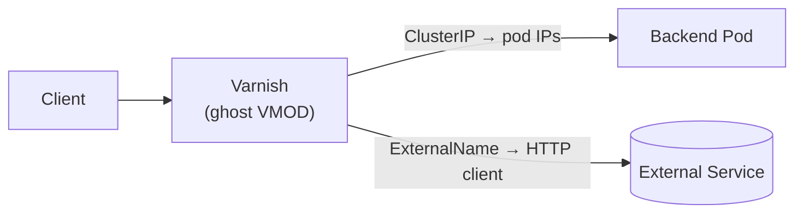

# External Backends

Route traffic to services running outside the Kubernetes cluster — cloud
storage, third-party APIs, on-prem servers — by combining a Kubernetes
`ExternalName` Service with a standard HTTPRoute `backendRef`.

## How it works

A Kubernetes Service of type `ExternalName` has no pods. Instead of
performing EndpointSlice lookups, Varnish Gateway detects the `ExternalName`
type and tells the ghost VMOD to create a **synthetic backend** backed by its
own HTTP client. The client handles DNS resolution, connection pooling, and
TLS transparently — so the external hostname can point to services with
rotating IP addresses without disrupting Varnish.



## Setup

### 1. Create an ExternalName Service

Point it at the external hostname. Use `appProtocol` to signal whether the
connection should use TLS.

```yaml
apiVersion: v1
kind: Service
metadata:
  name: external-api
  namespace: default
spec:
  type: ExternalName
  externalName: api.example.com
  ports:
    - port: 443
      appProtocol: https
```

| Field | Purpose |
|-------|---------|
| `externalName` | The DNS name of the external service. Ghost connects here. |
| `port` | The port ghost connects to on the external service. The HTTPRoute's `backendRef.port` must match one of the Service ports. |
| `appProtocol` | Set to `https` on the matched port to enable TLS. Without it ghost connects in plaintext. |

### 2. Reference it from an HTTPRoute

Use a standard `backendRef` pointing at the Service:

```yaml
apiVersion: gateway.networking.k8s.io/v1
kind: HTTPRoute
metadata:
  name: external-route
  namespace: default
spec:
  parentRefs:
    - name: my-gateway
  hostnames:
    - "myapp.example.com"
  rules:
    - backendRefs:
        - name: external-api
          port: 443
```

The `port` on the backendRef must match one of the ports declared on the
Service — it determines which `appProtocol` is used for the proxy connection.

### 3. Verify routing

Port-forward to the Gateway and send a request:

```bash
kubectl port-forward -n default svc/my-gateway 8080:80 &
curl -H "Host: myapp.example.com" http://localhost:8080/api/status
```

The request is proxied through Varnish, ghost opens an outbound connection to
`api.example.com:443` with TLS, and the response is returned to the client.

## TLS considerations

When `appProtocol: https` is set on the matched Service port, ghost
performs a standard TLS handshake against the external hostname:

- Certificate chain is validated against the Mozilla CA bundle compiled
  into the chaperone binary (`rustls` + `webpki-roots`), not the OS trust
  store.
- **SNI** is the Service's `externalName` value.
- The `Host` header sent to the upstream is also the `externalName` (any
  `Host` header set by user VCL or route filters is overridden).

`BackendTLSPolicy` is **not honoured** for ExternalName backends — it
applies only to in-cluster (ClusterIP) Services. Custom CA pinning and
SNI override for external proxies are not currently configurable.

### Plaintext backends

Omit `appProtocol` (or leave it unset) and use a non-TLS port. Ghost
connects in plain HTTP:

```yaml
spec:
  type: ExternalName
  externalName: legacy.internal
  ports:
    - port: 80
      # no appProtocol → plaintext
```

## How ghost proxies the request

Ghost maintains one stable Varnish backend per unique `(hostname, port, TLS)`
tuple. This gives predictable VBE (backend) statistics regardless of how
many IP addresses the external hostname resolves to. The underlying
`reqwest` client handles DNS and connection pooling internally:

- **DNS**: resolved via the system resolver; reqwest caches and re-resolves
  as needed.
- **Connection pooling**: idle connections are reused across requests.
- **TLS**: rustls per-connection, validated against the bundled
  `webpki-roots` CA store; SNI is the `externalName`.
- **Request forwarding**: method and headers are forwarded; the `Host`
  header is set to the `externalName`. Hop-by-hop headers (RFC 7230 §6.1)
  are stripped.
- **Response streaming**: chunks are streamed through to the client — ghost
  does not buffer the full response body.

## Limitations

- **Request bodies are not forwarded.** GET, HEAD, and OPTIONS are
  forwarded. POST, PUT, PATCH, and DELETE are rejected locally with
  `405 Method Not Allowed`, an `Allow: GET, HEAD, OPTIONS` header, and
  `Cache-Control: no-store` — the upstream is not contacted. Ghost also
  emits an `Error` line in `varnishlog`. The current ExternalName use case
  is read-only fan-out to object stores and third-party APIs.
- **`BackendTLSPolicy` is ignored** for ExternalName Services — custom CA
  pinning and SNI override are not currently supported. TLS is on/off based
  on `appProtocol` only.
- **No weighted traffic splitting across external targets within a single
  Service.** An ExternalName Service maps to a single external hostname.
  To split traffic across multiple external services, create one Service
  per target and use multiple `backendRefs` with weights in the HTTPRoute
  rule.
- **No health checking.** Ghost does not probe external backends. Failed
  requests surface as Varnish backend errors (typically a 503 to the
  client).
- **Timeouts are fixed.** Connect timeout is 10 seconds and overall request
  timeout is 60 seconds. Neither is currently configurable.

## See also

- [Architecture overview](../concepts/architecture.md) — how the data flows
  differ for ExternalName vs. ClusterIP backends
- [TLS guide](../guides/tls.md) — client-side and backend TLS configuration
- [Canary deployments](../guides/canary-deployments.md) — weighted traffic
  splitting across multiple backends (including a mix of in-cluster and
  external)
